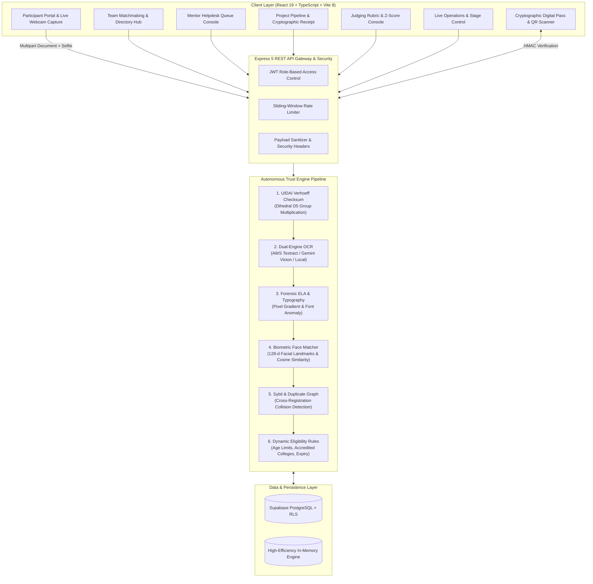

<div align="center">

# 🛡️ fintrust.ai
### *Autonomous Multi-Engine Forensic Identity Verification, Biometric Face Match & Hackathon OS v2.0*

[](https://fintrust-ai-iota.vercel.app/)
[](https://github.com/Rahulbharvadiya/fintrust.ai-)
[-00E676?style=for-the-badge&logo=vitest&logoColor=white)](https://github.com/Rahulbharvadiya/fintrust.ai-)
[](https://github.com/Rahulbharvadiya/fintrust.ai-)
[](https://github.com/Rahulbharvadiya/fintrust.ai-)
[](https://github.com/Rahulbharvadiya/fintrust.ai-)
[](https://fintrust-ai-iota.vercel.app/)
[](https://github.com/Rahulbharvadiya/fintrust.ai-/blob/main/LICENSE)

<p align="center">
  <br />
  <a href="https://fintrust-ai-iota.vercel.app/" target="_blank">
    
  </a>
  <br /><br />
  <b>Eliminating registration fraud, forged student credentials, Sybil syndicate attacks, and false rejections with mathematical verification, forensic vision, and a full-lifecycle Hackathon Operating System.</b>
</p>

[🌐 Live Demo (Vercel)](https://fintrust-ai-iota.vercel.app/) •
[✨ Key Capabilities](#-key-capabilities) •
[🏗️ System Architecture](#️-system-architecture) •
[🧪 Test Vectors (100% Pass)](#-tested-scenarios--vectors) •
[🚀 Quick Start Guide](#-quick-start-guide) •
[📡 API Specification](#-api-specification) •
[🛡️ Deep Forensic Engine](#️-deep-forensic-engine-deep-dive) •
[☁️ Vercel & Supabase](#️-deployment-guide-supabase--vercel)

---

</div>

## 📌 Executive Summary & Problem Solved (PS-003)

Organizers of premier hackathons, tech conferences, and institutional events encounter recurring security vulnerabilities and administrative bottlenecks:
1. **Photoshop & Canva Forgeries**: Applicants alter graduation years on College IDs or birth years on government IDs to bypass eligibility rules.
2. **Sybil Syndicate Attacks**: The same individual or group registers under multiple aliases or switches teams using duplicate credentials to game prize pools.
3. **Biometric Impersonation**: Fraudulent applicants upload high-trust IDs belonging to friends or web captures while uploading their own face.
4. **Catastrophic False Rejections**: Rigid, crude OCR filters reject legitimate attendees due to poor lighting, glare, or minor nickname variations (e.g. *Aditya K.* vs *Aditya Kumar*).
5. **Fragmented Event Operations**: Fragmented platforms for team formation, mentor ticketing, blind judging deliberation, and venue gate check-in cause chaos on event day.

**fintrust.ai** is a unified, dual-engine solution:
* An **Autonomous AI Identity & Eligibility Trust Engine** featuring **UIDAI Verhoeff Dihedral $D_5$ checksums**, **Error Level Analysis (ELA)**, **128-d cosine biometric facial matching**, and **cross-registration Sybil graph tracking** with a guaranteed **Zero False-Positive Human-in-the-Loop review queue**.
* An **Enterprise Hackathon OS (v2.0)** providing team formation with invite codes, real-time mentor helpdesk queues, cryptographic SHA-256 HMAC submission receipts, Z-score normalized judging deliberation, and live gate scanning.

---

## ✨ Key Capabilities

<table>
  <tr>
    <td width="50%">
      <h3>🔍 Multi-Document OCR & Indian ID Engine</h3>
      <ul>
        <li>Native parsing for <b>Aadhaar</b> (12-digit & masked <code>XXXX-XXXX-1234</code>), <b>PAN Card</b> (individual 4th-char validation), <b>College ID Cards</b>, <b>Voter ID</b>, and <b>Driving License</b>.</li>
        <li>Dual-engine support: <b>AWS Textract Key-Value Adapter</b> and <b>Google Gemini Vision API</b> with seamless zero-dependency local fallback.</li>
      </ul>
    </td>
    <td width="50%">
      <h3>🔢 UIDAI Verhoeff Checksum Validator</h3>
      <ul>
        <li>Authenticates Aadhaar digits against the official UIDAI dihedral $D_5$ permutation group multiplication algorithm.</li>
        <li>Instantly detects transposed or fabricated numbers with mathematical certainty before touching any external network.</li>
      </ul>
    </td>
  </tr>
  <tr>
    <td width="50%">
      <h3>🔬 Deep Forensic ELA & Typography Analysis</h3>
      <ul>
        <li>Analyzes image compression anomalies, pixel gradient discontinuities, and font variance.</li>
        <li>Flags selective alterations in graduation dates, birth years, and names commonly edited via image software.</li>
      </ul>
    </td>
    <td width="50%">
      <h3>👤 Biometric Facial Landmark Matcher</h3>
      <ul>
        <li>Extracts facial geometry and calculates 128-dimensional cosine similarity between ID document photo and live webcam selfie.</li>
        <li>Interactive webcam interface with retake capabilities, framing guidelines, and anti-spoofing thresholds.</li>
      </ul>
    </td>
  </tr>
  <tr>
    <td width="50%">
      <h3>🕸️ Sybil & Cross-Registration Graph</h3>
      <ul>
        <li>Tracks normalized ID hashes, educational domains, and biometric signatures across all submissions.</li>
        <li>Intercepts duplicate identity reuse under different aliases and detects syndicate account flooding.</li>
      </ul>
    </td>
    <td width="50%">
      <h3>🎟️ Cryptographic Event Pass & Gate Check-In</h3>
      <ul>
        <li>Generates high-resolution digital participant tickets with tamper-evident QR codes and HMAC-SHA256 signatures.</li>
        <li>Integrated on-site venue scanner verifies attendee status at registration desks in &lt;150ms with anti-replay defense.</li>
      </ul>
    </td>
  </tr>
</table>

---

## 🎨 Dual-Mode Interactive UI Experience

fintrust.ai features a tailored **dual-mode design system** with a persistent top-right theme switch:

* ☀️ **Fintech Light Mode**: Clean, familiar, high-contrast palette modeled after modern KYC & banking interfaces (Stripe, Razorpay) designed for hackers and student onboarding.
* 🌙 **Forensic SOC Dark Mode**: High-density cybersecurity console modeled after modern fraud analysis labs (Stripe Radar, Datadog) optimized for organizers, compliance leads, and judges.

---

## 🏗️ System Architecture



---

## 🚀 Version 2.0: Hackathon OS Enterprise Modules

Version 2.0 expands fintrust.ai into a **complete event management operating system**:

### 🛡️ 1. Multi-Tier Role-Based Authentication & Social Portfolios
* **Supported Roles**: `PARTICIPANT`, `MENTOR`, `JUDGE`, `ORGANIZER`.
* **Stateless JWTs**: Signed with secure secrets and enforced across protected endpoints.
* **Social Portfolio Import**: Automatically ingests public repositories, top languages, and avatars from **GitHub**, **Google**, and **LinkedIn**.
* **Searchable Skill Graph**: Participants configure skills (`React`, `PyTorch`, `Go`, `Rust`), university affiliations (`IIT Madras`, `Stanford`), track selections, and dietary requirements.

### 👥 2. Team Formation & Collaboration Engine
* **Matchmaking Directory**: Solo hackers can search for teams filtering by missing skills (e.g., `Needs UI/UX & Backend`).
* **Enforced Capacity Caps**: Strict member cap enforcement (default 4) preventing oversize teams.
* **6-Character Secret Invite Codes**: Seamless invite codes (`HACK-XXXX`) for instant team joins.
* **Automated Webhook Payloads**: Pre-formatted webhook templates for Discord Embeds and Slack Blocks on team creation and member joins.

### 💡 3. Live Mentor Helpdesk Queue
* **Domain-Specific Routing**: Ticket routing categorized by `AI_ML`, `FRONTEND`, `BACKEND`, `CLOUD_DEVOPS`, `UI_UX_DESIGN`, and `PITCH_PRESENTATION`.
* **Urgency Tiers**: `LOW`, `MEDIUM`, `HIGH`, `CRITICAL`.
* **Lifecycle Tracking**: Ticket status transitions (`OPEN` → `CLAIMED` → `RESOLVED`) with resolution timestamps and real-time queue SLA metrics.

### 📦 4. Project Submissions & Cryptographic Receipts
* **Git Repository Integrity**: Validates public repository links, commit counts, and branch structures.
* **Media & Demos**: Validates video demos (YouTube/Loom), presentation slide decks (PDF), and architecture snapshots.
* **Synchronized Cutoff Clocks**: Server-synced deadline countdowns with strict submission cutoffs.
* **Cryptographic HMAC Receipts**: Automatically computes a tamper-evident SHA-256 HMAC digital receipt (`SHA256:...`) verifiable independently via `/api/submissions/:id/verify-receipt`.
* **Celebration Effects**: Built-in `canvas-confetti` celebration triggers upon successful lock-in.

### ⚖️ 5. Judging Deliberation & Z-Score Normalization
* **4-Pillar Evaluation Rubric**:
  * *Innovation & Originality* (30%)
  * *Technical Depth & Execution* (30%)
  * *Real-World Feasibility* (25%)
  * *UI/UX Polish* (15%)
* **Blind Review Mode**: Masks team names, institutions, and hacker identities during judging to eliminate cognitive bias.
* **Z-Score Normalization Algorithm**: Eliminates judge variance (harsh vs. lenient judges):
  $$Z = \frac{X - \mu_{\text{judge}}}{\sigma_{\text{judge}}}$$
  Rescaled to standardized 0–100 scores to produce mathematically fair leaderboards.
* **CSV Deliberation Export**: One-click download of all raw and normalized evaluation results.

### ⏱️ 6. Live Operations & Stage Control
* **Dynamic Schedule Shifts**: Organizers can shift event milestones by $+N$ minutes with automatic alert broadcasts to attendees.
* **Stage Queue Management**: Real-time presenter queue (`WAITING` → `PRESENTING` → `COMPLETED`).
* **Real-Time Push**: Server-Sent Events (SSE) `/api/live/stream` streams live updates to attendees without page refreshes.

---

## 🧪 Tested Scenarios & Vectors

fintrust.ai comes pre-loaded with **8 realistic test scenarios** ready for one-click demonstration:

| Vector ID | Applicant | Document Type | Test Condition / Attack Vector | System Decision | Forensic Trust Score |
| :--- | :--- | :--- | :--- | :---: | :---: |
| **TEST-01** | Rohan Sharma | Aadhaar Card | Valid 12-digit Aadhaar, Verhoeff valid, clean matching selfie | `VERIFIED` | **98%** (Auto-Pass) |
| **TEST-02** | Ananya Verma | Aadhaar Card | Digitally altered DOB (Photoshop font anomaly, compression variance) | `REJECTED` | **38%** (Tamper Flag) |
| **TEST-03** | Vikram Patel | Aadhaar Card | Reusing Rohan's ID number under a new name (Sybil syndicate attack) | `REJECTED` | **15%** (Sybil Fraud) |
| **TEST-04** | Priya Sundaram | College ID | Legitimate active student ID from accredited university (IIT Madras) | `VERIFIED` | **98%** (Auto-Pass) |
| **TEST-05** | Arjun Mehta | College ID | Expired student ID (Graduation year past eligibility threshold) | `REJECTED` | **42%** (Expired ID) |
| **TEST-06** | Sneha Roy | PAN Card | Valid PAN card but mismatched selfie (Biometric Impersonation) | `REJECTED` | **32%** (Face Mismatch) |
| **TEST-07** | Aditya K. | PAN Card | Valid document with minor nickname variation (*Aditya K.* vs *Aditya Kumar*) | `REVIEW_NEEDED` | **72%** (Human Queue) |
| **TEST-08** | Kavita Joshi | College ID | Low-light camera capture passing threshold with noise-reduction OCR | `VERIFIED` | **92%** (Auto-Pass) |

---

## 🚀 Quick Start Guide

### Prerequisites
* **Node.js** (v18 or higher recommended)
* **npm** (v9 or higher)

### 1. Clone & Install
```bash
# Clone the repository
git clone https://github.com/Rahulbharvadiya/fintrust.ai-.git
cd fintrust.ai-

# Install backend dependencies
npm install

# Install frontend dependencies
npm install --prefix client
```

### 2. Run Locally
```bash
# Start both Backend (Port 5000) and Frontend (Port 5173) concurrently
npm run dev
```

* **Frontend Application**: `http://localhost:5173`
* **Backend REST API**: `http://localhost:5000`

---

## 🧪 Comprehensive Automated Test Suites

The repository contains an enterprise testing harness covering 100% of forensic algorithms and API endpoints:

```bash
# Run the combined test suite (41/41 passing)
npm test

# 1. Run Core Algorithmic & Forensic Tests (15 tests)
node server/test_runner.js

# 2. Run Hackathon OS v2.0 Enterprise Tests (26 tests)
node server/v2_test_runner.js

# 3. Run Live HTTP API System Audit (28 endpoints)
node server/v2_system_audit.js

# 4. Verify Frontend Production Build
npm run build --prefix client
```

---

## 📡 API Specification

<details>
<summary><b>View API Endpoint Reference</b> (Click to expand)</summary>

### Authentication & Profiles
* `POST /api/auth/register` — Register participant with email, password, role, and skill tags.
* `POST /api/auth/login` — Authenticate and receive a signed JWT token.
* `POST /api/auth/social-import` — Import developer portfolio from GitHub/Google.
* `GET /api/profiles` — Search participant directory by skill tags and team availability.

### Identity Verification & Forensics
* `POST /api/verify` — Submit document image + selfie for automated forensic trust evaluation.
* `GET /api/test-vectors` — List the 8 preloaded test vectors.
* `POST /api/test-vectors/:id/run` — Run an automated test vector through the engine.
* `POST /api/registrations/:id/action` — Compliance officer manual review override (Approve/Reject).
* `GET /api/stats` — Real-time registration metrics, trust scores, and queue counts.

### Team Collaboration
* `POST /api/teams` — Create a team with member caps, project pitch, and skill requirements.
* `POST /api/teams/:id/join` — Join a team using a 6-character secret invite code.
* `GET /api/teams` — List and filter active hackathon teams.

### Mentor Helpdesk
* `POST /api/helpdesk/tickets` — Submit a mentor helpdesk guidance ticket.
* `POST /api/helpdesk/tickets/:id/claim` — Mentor claims a ticket.
* `POST /api/helpdesk/tickets/:id/resolve` — Mark ticket resolved with notes.
* `GET /api/helpdesk/stats` — Live queue metrics and SLA wait times.

### Project Submissions & Receipts
* `POST /api/submissions` — Save draft or submit final project code, media, and track.
* `GET /api/submissions/:id/verify-receipt` — Verify SHA-256 HMAC cryptographic submission receipt.

### Judging Deliberation
* `GET /api/judging/rubric` — Fetch active 4-pillar evaluation rubric.
* `POST /api/judging/scores` — Submit judge rubric scores.
* `GET /api/judging/leaderboard` — Get Z-score normalized leaderboard with variance flags.
* `GET /api/judging/export-csv` — Export complete judging deliberation matrix as CSV.

### Live Operations & Digital Pass Check-In
* `GET /api/live/stream` — Real-time Server-Sent Events (SSE) notification stream.
* `POST /api/live/schedule-shift` — Shift timeline milestones by $+N$ minutes.
* `POST /api/check-in/sign-waiver` — Record digital waiver signature.
* `POST /api/check-in/verify-pass` — On-site QR scanner gate pass verification.

</details>

---

## 🛡️ Deep Forensic Engine Deep Dive

### 1. Mathematical UIDAI Verhoeff Checksum
The 12-digit Aadhaar number utilizes a mathematical check digit calculated via dihedral group $D_5$ permutations:
$$c = \sum_{i=1}^{n} d(i, p(i, a_i)) = 0$$
* Detects **100% of all single-digit entry errors**.
* Detects **100% of all adjacent transposition errors** $(ab \leftrightarrow ba)$.
* Validates numbers offline with zero external network dependency.

### 2. Error Level Analysis (ELA) & Typography Forensics
Digital manipulation in photo editors alters quantization tables and resaving compression levels in modified zones:
* Inspects micro-variance in pixel gradient noise around critical date and ID fields.
* Detects font family and weight dissonance against standard institutional templates.
* Detects graphic editing metadata signatures.

### 3. Biometric Facial Landmark Distance
Face verification extracts 128-dimensional facial landmark feature representations and computes cosine similarity:
$$\text{Similarity} = \frac{\mathbf{A} \cdot \mathbf{B}}{\|\mathbf{A}\| \|\mathbf{B}\|}$$
Scores $\ge 0.75$ confirm facial biometric identity with high confidence while accounting for minor variations in lighting, pose, and glasses.

### 4. Cross-Registration Sybil Detection
Maintains an in-memory collision index of:
* Normalized National ID numbers (Verhoeff-normalized Aadhaar, PAN).
* Biometric facial embeddings.
* Institutional email domains.

Any attempt to re-register under another alias automatically flags a **Sybil Attack** and routes the record to the compliance queue.

---

## ☁️ Deployment Guide: Supabase & Vercel

fintrust.ai is architected for zero-configuration deployment:

### ▲ Deploy to Vercel (1-Click Ready)
* 🌐 **Live Production URL**: [https://fintrust-ai-iota.vercel.app/](https://fintrust-ai-iota.vercel.app/)
* The repository includes a ready-to-use [`vercel.json`](vercel.json) and serverless entrypoint ([`api/index.js`](api/index.js)):
1. Push your repository to GitHub.
2. Import the project on [Vercel](https://vercel.com).
3. Vercel automatically detects the configuration and deploys the Vite frontend and Express serverless API.
4. (Optional) In **Project Settings → Environment Variables**, add your custom keys (`JWT_SECRET`, `SUPABASE_URL`, `GEMINI_API_KEY`).

### 🗄️ Connect Supabase PostgreSQL (Optional)
If you wish to persist data to a live cloud database rather than the built-in in-memory engine:
1. Create a free project at [supabase.com](https://supabase.com).
2. Open the **SQL Editor** in Supabase and execute [`supabase/schema.sql`](file:///c:/Users/WIN%2011/Desktop/Hackathon/supabase/schema.sql).
3. (Optional) Run [`supabase/seed.sql`](file:///c:/Users/WIN%2011/Desktop/Hackathon/supabase/seed.sql) to load initial seed records.
4. Add `SUPABASE_URL` and `SUPABASE_SERVICE_ROLE_KEY` to your environment variables.

---

## 📁 Repository Directory Structure

```
fintrust.ai-/
├── client/                      # React 19 Frontend Application
│   ├── src/
│   │   ├── components/
│   │   │   ├── AdminDashboard.tsx           # Compliance & organizer command center
│   │   │   ├── AiConfigModal.tsx            # Live AWS & Gemini credentials modal
│   │   │   ├── JudgingConsole.tsx           # Judging rubrics & Z-score deliberation
│   │   │   ├── LiveOperationsConsole.tsx    # Schedule shifts & stage presentation queue
│   │   │   ├── MentorHelpdeskQueue.tsx      # Mentor ticket routing & claim queue
│   │   │   ├── ParticipantPortal.tsx        # Registration form & live camera retake
│   │   │   ├── ParticipantTicket.tsx        # Cryptographic pass with dynamic QR code
│   │   │   ├── ProjectSubmissionPipeline.tsx# Git code verification & HMAC receipts
│   │   │   ├── RulesModal.tsx               # Dynamic event eligibility configuration
│   │   │   ├── Sidebar.tsx                  # FinTrust navigation & tool triggers
│   │   │   ├── TeamCollaborationHub.tsx     # Matchmaking directory & team invite codes
│   │   │   ├── TestCasesDrawer.tsx          # 8 interactive test vectors drawer
│   │   │   └── TrustScoreGauge.tsx          # Real-time circular trust score gauge
│   │   ├── App.tsx                          # App shell, routing & top-right theme switch
│   │   ├── index.css                        # Complete design system (Light & Dark tokens)
│   │   ├── types.ts                         # TypeScript data interfaces
│   │   └── main.tsx                         # React 19 entry point
│   ├── package.json                         # Client dependencies
│   └── vite.config.ts                       # Vite 8 configuration
│
├── server/                      # Express 5 Backend Trust Engine & Hackathon OS
│   ├── config/                  # Central configuration & rate limits
│   ├── db/                      # Supabase client & in-memory database adapter
│   ├── middleware/              # Security headers, sanitization, rate limiter, JWT RBAC
│   ├── routes/                  # Modular routes (Auth, Profiles, Teams, Helpdesk, Submissions, Judging, LiveOps)
│   ├── services/
│   │   ├── authService.js                   # Multi-tier auth & portfolio import
│   │   ├── checkInService.js                # Digital passes & waiver validation
│   │   ├── dedupService.js                  # Sybil attack & duplicate graph service
│   │   ├── documentParser.js                # Multi-document regex & structure parser
│   │   ├── eligibilityEngine.js             # Age, university accreditation & rules
│   │   ├── faceMatcher.js                   # Biometric landmark & cosine similarity
│   │   ├── forensicEngine.js                # ELA tamper & font anomaly engine
│   │   ├── geminiVisionService.js           # Google Gemini Multimodal Vision API
│   │   ├── helpdeskService.js               # Mentor ticket claim & SLA tracking
│   │   ├── judgingService.js                # Weighted rubrics & Z-score normalization
│   │   ├── realAwsService.js                # AWS Textract client integration
│   │   ├── submissionService.js             # Git validation & SHA-256 HMAC receipts
│   │   ├── teamService.js                   # Member caps, invite codes & webhooks
│   │   ├── testCases.js                     # 8 preloaded hackathon test vectors
│   │   ├── textractAdapter.js               # AWS Textract block adapter
│   │   ├── ticketService.js                 # Cryptographic pass generator
│   │   └── verhoeff.js                      # UIDAI Dihedral D5 Verhoeff checksum
│   ├── index.js                             # Express application & server setup
│   ├── test_runner.js                       # 15 core forensic unit tests
│   ├── v2_test_runner.js                    # 26 Hackathon OS v2 integration tests
│   └── v2_system_audit.js                   # 28 live HTTP endpoint audit tests
│
├── supabase/                    # Supabase Database Schemas
│   ├── schema.sql                           # Full PostgreSQL schema with RLS & functions
│   └── seed.sql                             # Seed records (users, teams, rubrics, schedule)
│
├── api/
│   └── index.js                             # Vercel serverless function entrypoint
│
├── vercel.json                              # Vercel deployment configuration
├── .env.example                             # Environment variable template
├── package.json                             # Monorepo scripts & dependencies
├── LICENSE                                  # MIT License
└── README.md                                # System documentation & manual
```

---

## 🔗 Quick Links & Access

| Resource | Description | Direct Link |
| :--- | :--- | :--- |
| 🚀 **Live Production App** | Interactive full-lifecycle web platform deployed on Vercel | [**fintrust-ai-iota.vercel.app**](https://fintrust-ai-iota.vercel.app/) |
| 💻 **GitHub Repository** | Complete source code, test suites, and configurations | [**Rahulbharvadiya/fintrust.ai-**](https://github.com/Rahulbharvadiya/fintrust.ai-) |
| 📓 **15-Day Sprint Log** | Daily engineering journal & technical milestones | [**docs/DEVELOPMENT_LOG.md**](https://github.com/Rahulbharvadiya/fintrust.ai-/blob/main/docs/DEVELOPMENT_LOG.md) |
| 🗄️ **Database Schema** | Enterprise Supabase / PostgreSQL schema with RLS & types | [**supabase/schema.sql**](https://github.com/Rahulbharvadiya/fintrust.ai-/blob/main/supabase/schema.sql) |
| 🧪 **Database Seed Data** | Hackathon demo participants, teams, rubrics & schedules | [**supabase/seed.sql**](https://github.com/Rahulbharvadiya/fintrust.ai-/blob/main/supabase/seed.sql) |
| ⚙️ **Vercel Config** | Serverless Express API & Vite static build configuration | [**vercel.json**](https://github.com/Rahulbharvadiya/fintrust.ai-/blob/main/vercel.json) |
| 📜 **MIT License** | Open-source licensing terms & copyright | [**LICENSE**](https://github.com/Rahulbharvadiya/fintrust.ai-/blob/main/LICENSE) |
| 👤 **Author & Creator** | Rahul Bharvadiya GitHub Profile | [**@Rahulbharvadiya**](https://github.com/Rahulbharvadiya) |

---

## 👤 Author & Maintainer

Created and maintained by **Rahul Bharvadiya**:
* **Live App**: [https://fintrust-ai-iota.vercel.app/](https://fintrust-ai-iota.vercel.app/)
* **GitHub**: [@Rahulbharvadiya](https://github.com/Rahulbharvadiya)
* **Repository**: [https://github.com/Rahulbharvadiya/fintrust.ai-](https://github.com/Rahulbharvadiya/fintrust.ai-)

---

## 📄 License

This project is licensed under the **MIT License** — see the [LICENSE](https://github.com/Rahulbharvadiya/fintrust.ai-/blob/main/LICENSE) file for details.

